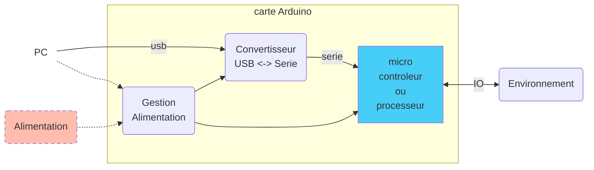
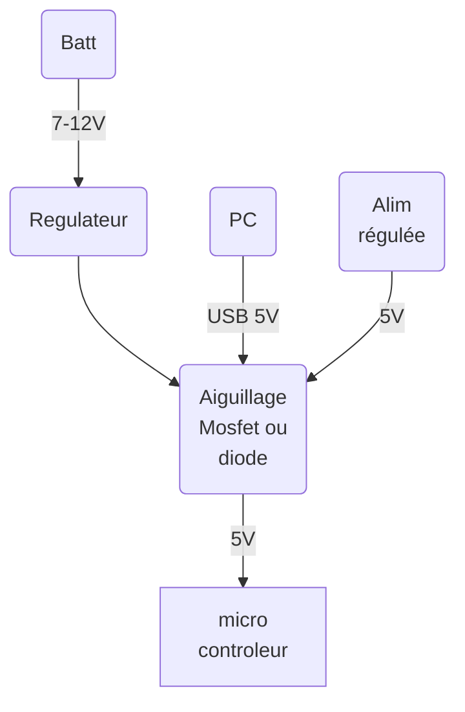
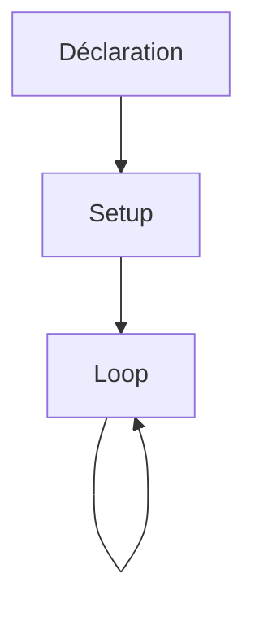

## 1 - Introduction

Lorsque l'on parle d'arduino, on peut en fait parler de **quatre choses distincts** et pourtant **étroitement liées**
- Les cartes physiques développées par la société Arduino
- Framework Arduino
- Le Logiciel Arduino IDE
- La communauté Arduino

On peut également parler plus généralement de la marque [Arduino](https://www.arduino.cc/) qui conçois et propose sur les marchés les cartes physique de prototypage open-source ainsi que les logiciels associés.

## 2 - Les cartes

### 2.1 - Historique

La première carte arduino développée, et la plus populaire encore maintenant, est la carte Arduino UNO. 

Elle a été créée dans les années 2000 par Massimo Banzi, David Cuartielles, Tom Igoe, Gianluca Martino, David Mellis et Nicholas Zambetti, à l’Interaction Design Institute d’Ivrea, en Italie, dans le cadre d'un projet étudiant.

A époque, les outils pour développer des projets embarqués ne sont pas accessible, tant en terme de prix (plusieurs centaines d'euros) qu'en terme d'accès, notamment pour des personnes dont les domaines de prédilections sont loin d'être techniques. Maîtriser et utiliser ces composants demandait beaucoup de temps et d’apprentissage et ralentissait fortement le processus de création pour ces jeunes étudiants.

  
*Premier modèle de carte Arduino*

La carte **wiring** (ancêtre de l'arduino UNO) va être la première création du groupe d'étudiant en 2003. Le but étant de créer une carte simple et à coût très bas afin qu'elle soit le plus facilement utilisable par une communauté novice. Pour ce qui est de la programmation, ils baseront leur interface de code sur environnement de développement [Processing](https://processing.org) mis au point en 2001 par des étudiants du MIT.

  
*Comparaison processing / arduino IDE*

Visant à rendre la plateforme toujours moins chère et plus accessible, une équipe d’étudiants et de professeurs finirent par concevoir la toute première Arduino en 2005. Entièrement open source, l’Arduino présentait l’avantage d’être multiplateforme et d’être en perpétuelle optimisation par la communauté d’utilisateurs.

---

### 2.2 - Principes

L'ensemble des cartes Arduino fonctionnent sur un principe quasi similaire, et sont basées sur un composant central : le microcontrôleur. 



#### a. Le micro-contrôleur

Le coeur de la carte. C'est le composant qui va être programmé et va exécuter la succession d'instructions nécessaires à l'interface des entrées sorties avec l'environnement.

Selon les cartes, il existe différents types de μC et vous pouvez en retrouver une liste non exhaustive sur le [wiki arduino de wikipedia](https://fr.wikipedia.org/wiki/Arduino).

Selon le μC, les capacités de calculs et d'entrée / sortie seront différentes. Il faudra donc être vigilant quant au choix de la carte et des conditions d'utilisation.


#### b. Le convertisseur USB - Serie

Afin de simplifier la liaison du micro-contrôleur avec l'ordinateur et de limiter l'usage de boitier externes supplémentaires, un composant va se charger de faire la conversion entre un port USB et le port série du micro-contrôleur. Ce fonctionnement va permettre deux choses :
- La programmation du composant directement en USB. Le micro-contrôleur sera préprogrammé avec un bootloader permettant ce type de programmation
- L'interfaçage série entre le PC et le micro-contrôleur, la carte étant détectée comme interface série par un PC. 





#### c. Gestion de l'alimentation

Selon les cartes, on trouvera un étage de conversion ou de gestion de l'alimentation. En effet, les composants devant fonctionner avec des niveaux de tension précis (classiquement 5V ou 3,3V), il faut s'assurer de la conversion de tension entre l'entrée d'alimentation et les composants. 

Les cartes pouvant être alimentées par le port d'upload (USB) ou par un alimentation externe, il est souvent nécessaire d'effectuer une conversion. Rappelons que l'USB d'un PC peut délivrer dans la majorité des cas une tension de 5V sous 500mA max.

Sur les cartes les plus simples, aucune gestion de l'alimentation n'est réalisée. C'est à la charge de l'utilisateur de fournir les tension d'alimentation adequats. 

Mais traditionnellement, on va trouver ce type de montage sur les cartes Arduino en 5V:







#### d. Entrée - Sortie

Chaque carte Arduino possède des périphériques d'entrées sorties. La gestion et les fonctionnalités dépendent de la carte choisie. Il faut donc correctement se renseigner sur les datasheet des cartes utilisées afin d'en connaitre précisément ses capacités. 

Dans le cas d'une arduino UNO, on retrouve l'architecture suivante :


- **USB :** Programmation et liaison série
- **Alimentation (7v-12V) :** Source d'alimentation externe 
- **A :** 
    * Entrées-sorties numériques
    * Sorties PWM
    * Bus de communication série
- **B :**
    * Entrées-sorties numériques
    * Entrées analogiques
    * Bus de communication I2C
- **C :**
    * 5V et 3,3V
    * GND
- **D :** Reset externe

## 3 - Le Framework Arduino

### 3.1 - Définitions

*Extrait de ["Framework - Wikipédia"](https://fr.wikipedia.org/wiki/Framework)*

---

En programmation informatique, un framework [...] désigne un ensemble cohérent de composants logiciels structurels, qui sert à créer les fondations ainsi que les grandes lignes de tout ou partie d'un logiciel (architecture). Un framework se distingue d'une simple bibliothèque logicielle principalement par :

* son caractère générique, faiblement spécialisé, contrairement à certaines bibliothèques ; un framework peut à ce titre être constitué de plusieurs bibliothèques, chacune spécialisée dans un domaine. Un framework peut néanmoins être spécialisé sur un langage particulier, une plateforme spécifique, un domaine particulier : communication de données, data mapping, etc. ;

* le cadre de travail qu'il impose dû à sa construction même, guidant l'architecture logicielle voire conduisant le développeur à respecter certains patrons de conception ; les bibliothèques le constituant sont alors organisées selon le même paradigme.

Les frameworks sont donc conçus et utilisés pour modeler l'architecture des logiciels applicatifs, des applications web, des middlewares et des composants logiciels. Les frameworks sont acquis par les informaticiens, puis incorporés dans des logiciels applicatifs mis sur le marché, ils sont par conséquent rarement achetés et installés séparément par un utilisateur final.

---

Dans notre cas, le Framework Arduino est un Framework particulier qui permet de programmer simplement les fonctionnalités hardware liées aux micro-contrôleurs, ou micro-processeurs, utilisés sur les cartes compatibles. 

Ce FrameWork est basé sur l'usage du C++ et améliore expérience utilisateur dans la démarche de programmation des cartes.

**Il est donc important de noter et de retenir les points suivants :**
- Le Framework n'est qu'une couche software simplifiant la programmation
- Le Framework peut être supplanté par des commandes bas niveaux afin de piloter plus finement le fonctionnement hardware du micro-contrôleur.
- Le Langage C C++ utilisé, ses structures, ses possibilités reste inchangées dans la mesure où elle sont adaptées à environnement embarqué.
- Le Framework peut s'utiliser en dehors du logiciel Arduino IDE
- Le Framework peut être utilisé sur d'autres cartes que celles produites par Arduino

### 3.2 - Spécificités Arduino

Vous pouvez retrouver l'ensemble des fonctionnaltiés du framework Arduino sur [la doc de référence](https://www.arduino.cc/reference/en/)[fr](https://www.arduino.cc/reference/fr/) en ligne.

Cette documentation vous donne accès à l'ensemble des fonctionnalités prévues dans le Framework et sont classées en 3 catégories :
- Les structures
- Les Variables
- les Fonctions

Ces fonctionnalités sont accessibles sans ajout de librairies supplémentaires. Attention cependant : en fonction du type de carte et du type de micro-contrôleur, certaines fonctionnalités peuvent être limitées. 

De plus, la structure d'un programme avec le Framework arduino diverge d'une structure standard de code C. En effet la structure classique d'un programme en C va être la suivante :

``` c++
/* Déclarations */
#include <lib.h>

/* Corps du programme */
int main
{
    ...
    return 0;
}
```
Dans le cas d'un programme pour micro-contrôleur, on retrouvera la structure suivante

``` c++
/* Déclarations */
#include <lib.h>

/* Corps du programme */
int main
{
    ...
    /* boucle infinie */
    while(1)
    {
        ...
    }
}
```

En effet, le µC exécutant son programme embarqué en boucle tant qu'il est alimenté, on ajoute une boucle infinie grace, par exemple, à l'instruction `while(1)`.

Dans le cas du Framework Arduino, on va utiliser exactement le même principe mais avec une structure dédiée.

``` c++
/* Déclarations */
#include <Arduino.h>

/* init du programme */
void setup()
{
    ...
}
/* boucle infinie */
void loop()
{ 
    ...
}
```

En effet, les fonctions `void setup()` et `void loop()` sont déjà créées et nécessaires à la compilation du programme principale. 

- `void setup()` : Initialisation du programme - un seul passage au reset du µC
- `void loop()` : Boucle infinie - programme principal







## 4 - Environnement de développement

### 4.1 - Arduino IDE

L'IDE Arduino est l'environnement de développement dédié aux cartes Arduino est compatible. Cet environnement très basique est hérité de [Processing](https://processing.org), et permet d'écrire des programme en C sous le framework Arduino et de compiler et uploader ce programme vers une carte compatible.

Le logiciel est multiplateforme et OpenSource. Il se télécharge via le site Arduino. [Lien de téléchargement](https://www.arduino.cc/en/software).

Depuis le 15 septembre 2022, la société Arduino a sorti une version stable de sa nouvelle version de l'IDE Arduino : [IDE Aduino 2.0](https://docs.arduino.cc/software/ide-v2).  Vous pouvez la télécharger sur le lien ci-dessous :

[Télécharger IDE Arduino 2.0](https://www.arduino.cc/en/software)

Pour poursuivre vers l'installation de l'IDE, vous pouvez suivre le lien ci-dessous :

[Tutoriel IDE Arduino](../../softs/arduino-ide-v2)

### 4.2 - PlatformIO

PlatformIO est une alternative à l’IDE Arduino permettant de développer des objets connectés ou du code pour micro-contrôleur d’une manière plus générale. PlatformIO n’est pas un éditeur de code : c’est un ensemble d’outils (toolchains) sous la forme de plugin pour Visual Studio Code (ou VSCode) de Microsoft et Atom de GitHub (également Microsoft !). 

Atom étant en perte de vitesse en terme de développement, nous vous conseillons de vous orienter vers VSCode. VSCode est un éditeur de code léger et gratuit pour Windows, macOS, Linux. Il permet de réaliser des projets de développement sur quasi n'importe quel support.

[Télécharger VSCode](https://code.visualstudio.com)

VSCode à l'avantage de s'intégrer parfaitement dans une multitude de projet de développement et d'être entièrement personnalisable via des extensions.

[Tutoriel VSCode - PlateformIO](../../softs/platformio)

---

## Sources

* [Arduino Education](https://arduino.education/?page_id=27)
* [Wikipedia - Arduino](https://fr.wikipedia.org/wiki/Arduino)
* [Historique Arduino - eni](https://www.editions-eni.fr/open/mediabook.aspx?idR=a81a087b555eea0aad94df95ee8febf4)


---

