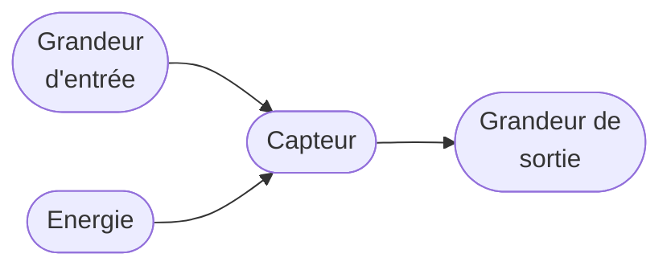
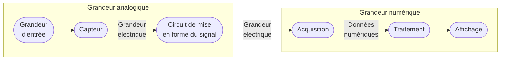
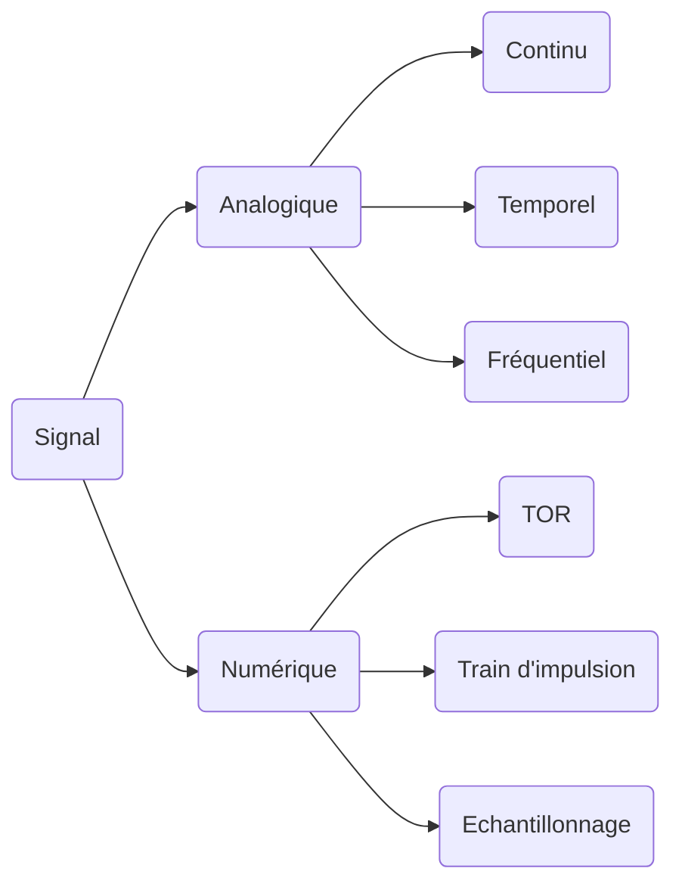

# Les capteurs
*ou "Comment acquérir une grandeur physique"*

[Extrait du cours "Acquisition d'une grandeur physique" par Christian BISSIERES ](https://www.les-electroniciens.com/sites/default/files/cours/capteurs.pdf)

## GENERALITES

### 1 - Introduction

Que ce soit dans les process industrielles, les véhicules, les objets connectés ou les dispositif vidéo-ludiques, il est systématiquement nécessaire d'avoir recours à des des dispositifs permettant de récupérer une information sur l'environnement physique du système et d'en faire le traitement. Ces dispositifs sont appelés "capteurs" et sont indispensable dans la mesure des grandeurs physique désirées. 

---

#### a. Définitions

**Un Capteur**

On appel capteur le dispositif qui permet de récupérer une information provenant d'une grandeur physique et de la transformer en une autre grandeur physique. Cette dernière est représentative de la grandeur mesurée et va être utilisée dans un but de mesure ou de commande.

Bien souvent, la grandeur physique de sortie et de nature electrique, mais il existe bien évidemment d'autre type de sorties possible selon le besoins en mesure ou en commende désirés. Par exemple, il est tout à fait possible de retrouver des capteurs ayant comme grandeur physique de sortie une pression d'air variable dans des systèmes pneumatiques.

**Etendue de mesure :** Valeurs extrêmes pouvant être mesurée par le capteur.

**Résolution :** Plus petite variation de grandeur mesurable par le capteur.

**Sensibilité :** Variation du signal de sortie par rapport à la variation du signal d'entrée.



**Précision :** Aptitude du capteur à donner une mesure proche de la valeur vraie.

**Rapidité :** Temps de réaction du capteur. La rapidité est liée à la bande passante. 

---

#### b. Quelques éléments de métrologie

**Le mesurage :** C'est l'ensemble des opérations ayant pour but de déterminer une valeur
d'une grandeur.

**La mesure (x) :** C'est l'évaluation d'une grandeur par comparaison avec une autre grandeur
de même nature prise pour unité.



**La grandeur (X) :** Paramètre qui doit être contrôlé lors de l'élaboration d'un produit ou de
son transfert.



**L'incertitude (dx) :** Le résultat de la mesure x d'une grandeur X n'est pas complètement défini par un seul nombre. Il faut au moins la caractériser par un couple (x, dx) et une unité de mesure. dx est l'incertitude sur x. Les incertitudes proviennent des différentes erreurs liées à la mesure. Ainsi, on a : 

$ x-dx < X < x+dx $ 

{% include message.html 
message="**Exemple :** 3 cm ±10%, ou 3 cm ± 3 mm." 
status="is-info" %}

**Erreur absolue (e) :** Résultat d'un mesurage moins la valeur vraie du mesurande. Une erreur
absolue s'exprime dans l'unité de la mesure.

$ e = x - X $



**Erreur relative (er) :** Rapport de l'erreur de mesure à une valeur vraie de mesurande. Une
erreur relative s'exprime généralement en pourcentage de la grandeur
mesurée.

$ e_r = e/X $

$ e_{r percent} = 100 e_r $

{% include message.html 
message="**Exemple :** Une erreur de 10 % sur une mesure de distance (10 % de la distance réelle). " 
status="is-info" %}

---

#### c. Types d'erreurs classiques



---

### 2 - Caractéristiques d'une chaîne de mesure informatisée

La structure de base d'une chaîne de mesure comprend au minimum quatre étages :

* Un capteur sensible aux variations d'une grandeur physique et qui, à partir de ces variations, délivre un signal électrique.
* Un conditionneur de signal dont le rôle principal est l'amplification du signal délivré par le capteur pour lui donner un niveau compatible avec l'unité de numérisation; cet étage peut parfois intégrer un filtre qui réduit les perturbations présentes sur le signal.
* Une unité de numérisation qui va échantillonner le signal à intervalles réguliers et affecter un nombre (image de la tension) à chaque point d'échantillonnage.
* L'unité de traitement informatique peut exploiter les mesures qui sont maintenant une suite de nombres (enregistrement, affichage de courbes, traitements Mathématiques, transmissions des données …).

De nos jours, compte tenu des possibilités offertes par l'électronique et l'informatique, les capteurs délivrent un signal électrique et la quasi-totalité des chaînes de mesure sont des chaînes électroniques et informatiques. 

Certains capteurs, par exemple le thermomètre DALLAS DS1621, délivrent directement un mot binaire, image de la température, en leur sortie. Ils intègrent, dans un seul boîtier (DIL 08) le capteur + le circuit de mise en forme + le CAN.

---

### 3 - Classification des signaux

Un signal est dit analogique si l'amplitude de la grandeur physique le représentant peut prendre une infinité de valeurs dans un intervalle donné.

* **Signal continu :** C'est un signal qui varie 'lentement' dans le temps : température, débit, niveau.
* **Forme :** C'est la forme de ce signal qui est importante : pression cardiaque, chromatographie, impact.
* **Fréquentiel :** C'est le spectre fréquentiel qui transporte l'information désirée : analyse vocale, sonar, spectrographie. 

Un signal est dit numérique si l'amplitude de la grandeur physique le représentant ne peut prendre qu'un nombre fini de valeurs. En général ce nombre fini de valeurs est une puissance de 2.

* **Tout ou rien (TOR) :** Il informe sur l'état bivalent d'un système. 

    `Une vanne ouverte ou fermée.`

* **Train d'impulsion :** Chaque impulsion est l'image d'un changement d'état. 

    `Un codeur incrémental donne un nombre fini et connu d'impulsion par tour.`

* **Echantillonnage :** C'est l'image numérique d'un signal analogique.

    `Température, débit, niveau, son (pression)…`

---

## LES DIFFÉRENTES FAMILLES DE CAPTEURS

Si l'on s'intéresse aux phénomènes physiques mis en jeux dans les capteurs, on peut classer ces derniers en deux catégories. 

---

### 1 - Capteurs actifs

Fonctionnant en générateur, un capteur actif est généralement fondé dans son principe sur un effet physique qui assure la conversion en énergie électrique de la forme d'énergie propre à la grandeur physique à prélever, énergie thermique, mécanique ou de rayonnement.

Les effets physique les plus classiques sont :

* **Effet thermoélectrique :** Un circuit formé de deux conducteurs de nature chimique différente, dont les jonctions sont à des températures T1 et T2, est le siège d'une force électromotrice d'origine thermique e(T1,T2).
* **Effet piézo-électrique :** L'application d'une contrainte mécanique à certains matériaux dits piézo-électriques (le quartz par exemple) entraîne l'apparition d'une déformation et d'une même charge électrique de signe différent sur les faces opposées.
* **Effet d'induction électromagnétique :** La variation du flux d'induction magnétique dans un circuit électrique induit une tension électrique (détection de passage d'un objet métallique).
* **Effet photo-électrique :** La libération de charges électriques dans la matière sous l'influence d'un rayonnement lumineux ou plus généralement d'une onde électromagnétique.
* **Effet Hall :** Un champ magnétique B et un courant électrique I créent dans le matériau une différence de potentiel UH .
* **Effet photovoltaïque :** Des électrons et des trous sont libérés au voisinage d'une jonction PN illuminée, leur déplacement modifie la tension à ses bornes. 

| Grandeur physique mesurée   | Effet utilisé               | Grandeur de sortie | 
| ---                         | :---:                       | ---                | 
| Température                 | Thermoélectricité           | Tension            |
| Flux de rayonnement optique | Photo-émission              | Courant            |
| ^^                          | Effet photovoltaïque        | Tension            |
| ^^                          | Effet photo-électrique      | Tension            |
| Force                       | Piézo-électricité           | Charge électrique  |
| Pression                    | ^^                          | ^^                 |
| Accélération                | Induction électromagnétique | Tension            |
| Vitesse                     | ^^                          | ^^                 |
| Position (Aimant)           | Effet Hall                  | Tension            |
| Courant                     | ^^                          | ^^                 |

---

### 2- Capteurs passifs

Il s'agit généralement d'impédance dont l'un des paramètres déterminants est sensible à la grandeur mesurée. La variation d'impédance résulte :
* Soit d'une variation de dimension du capteur, c'est le principe de fonctionnement d'un grand nombre de capteur de position, potentiomètre, inductance à noyaux mobile, condensateur à armature mobile.
* Soit d'une déformation résultant de force ou de grandeur s'y ramenant, pression accélération (armature de condensateur soumise à une différence de pression, jauge d'extensomètre liée à une structure déformable). 

| Grandeur mesurée              | Caractéristique électrique sensible   | Type de matériau utilisé                                      |
| ---                           | ---                                   | ---                                                           |
| Température                   | Résistivité                           | Métaux : platine, nickel, cuivre ...                          |
| Très basse température        | Constante diélectrique                | Verre                                                         |
| Flux de rayonnement optique   | Résistivité                           | Semi-conducteur                                               |
| Déformation                   | Résistivité                           | Alliage de Nickel, silicium dopé                              |
| ^^                            | Perméabilité magnétique               | Alliage ferromagnétique                                       |
| Position (aimant)             | Résistivité                           | Matériaux magnéto résistants : bismuth, antimoine d'indium    |
| Humidité                      | Résistivité                           | Chlorure de lithium                                           |

## RÉCAPITULATIF

* Un capteur transforme généralement une grandeur physique en une grandeur électrique.
* La relation grandeur physique ↔ grandeur électrique est souvent linéaire.
* Les capteurs résistifs sont souvent utilisés de deux façons :
    * alimentés à courant constant (tension proportionnelle à la résistance)
    * placés dans un pont de jauge (tension quasi-proportionnelle à la résistance).
* On trouve de plus en plus des capteurs à sortie numérique directe.

**Remarque :** Il est important de connaître les principes des phénomènes physiques liés aux capteurs. 

## ALLER PLUS LOIN

* [Cours sources : "Acquisition d'une grandeur physique" par Christian BISSIERES ](https://www.les-electroniciens.com/sites/default/files/cours/capteurs.pdf)